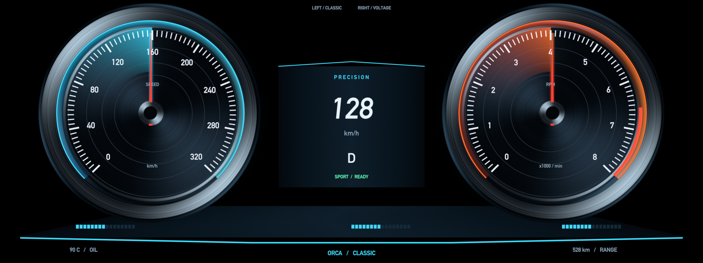
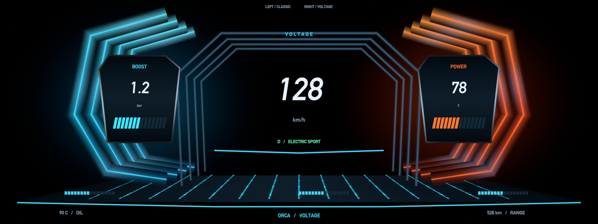

# Precision / Voltage

A Blender-authored 3D instrument display with two clusters in one scene, spaced
5.6 units apart. **Left** selects Classic / Precision; **Right** selects Cool /
Voltage; **Q** exits. The camera travels between them over 1.35 seconds while the
outgoing components retract and the incoming components fly forward in sequence.
Changing direction during travel continues from the current pose.




Four concepts were explored in [the concept sheet](design/concepts.png).
Precision and Voltage were selected for their contrasting radial and angular
forms. Precision uses recessed machined gauge drums, layered bezels, luminous
scale arcs and moving needles. Voltage uses extruded cyan/orange fins, suspended
readouts and a floor extending into a deep energy tunnel.

Glow is computed in exportable shaders, without bloom or compositing. The
`IC_Energy` shader combines travelling harmonics and a soft transverse falloff;
its Phase animation loops seamlessly. `IC_SpunMetal` supplies conic highlights
and fine concentric grooves. Both Blender and ORCA use the same analytic shader
expressions and UV coordinates.

The original looping `Demo/FillAll` still scrubs the gauge clips together; a speed
needle has been added. `Demo/DriveCycle` provides a more varied alternative.
`Animations.lua` retains signal names and input ranges for a data-driven app.
Numeric readout text is baked presentation content, as in the original demo;
needles, sweep fills, utility bars and electrical flow animate independently of
navigation. Navigation moves component group translations, preserving the
nested signal-driven gauge transforms.

Run from the repository root:

```sh
build/bin/orca apps/cluster-demo
make cluster START=voltage   # builds first, opens on Voltage
build/bin/orca -test=apps/cluster-demo/Tests/navigation.lua
```

`blender/cluster.blend` contains both complete clusters, the display camera and
value-driven gauge actions. `blender/cluster-before-redesign.blend` preserves the
original scene. `blender/build_cluster.py` is the reproducible source. Run it in
Blender's Python context to rebuild; save the resulting scene, then export:

```python
import bpy, runpy
runpy.run_path('/absolute/path/to/orca/apps/cluster-demo/blender/build_cluster.py')
bpy.ops.wm.save_as_mainfile(filepath='/absolute/path/to/orca/apps/cluster-demo/blender/cluster.blend')
runpy.run_path('/absolute/path/to/orca/tools/blender-export.py')['export'](
    '/absolute/path/to/orca/apps/cluster-demo', collection='InstrumentCluster')
```

The app-owned screen, controller and demo clips survive regeneration. Keep the
screen camera matched to the camera element reported by the exporter. Do not
edit the generated scene, materials, meshes, shaders or gauge clips directly.
